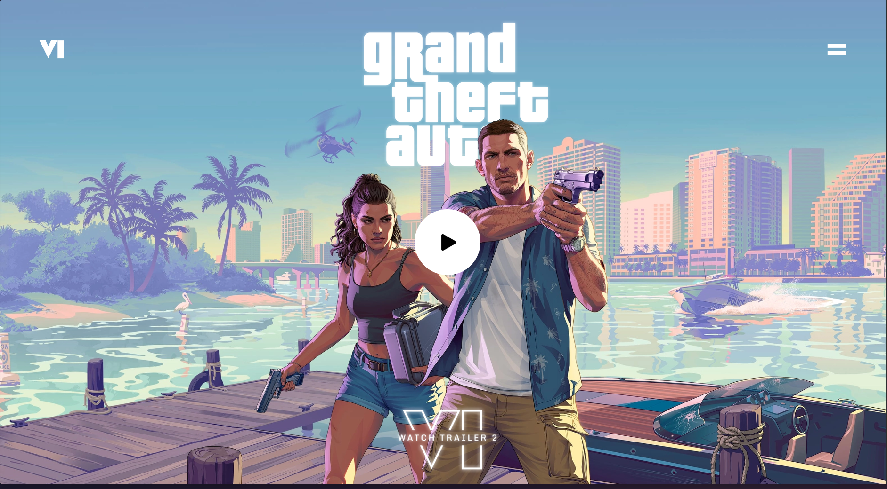
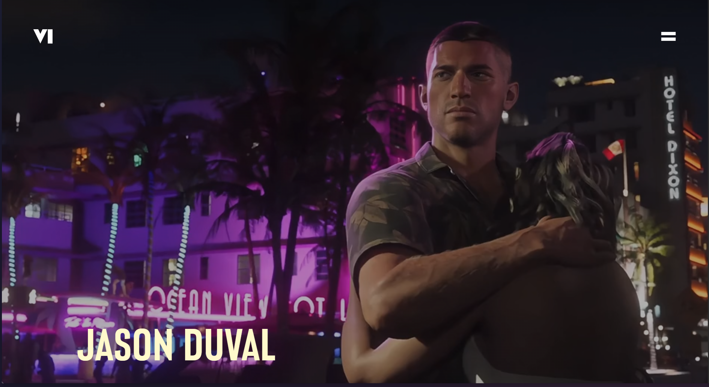
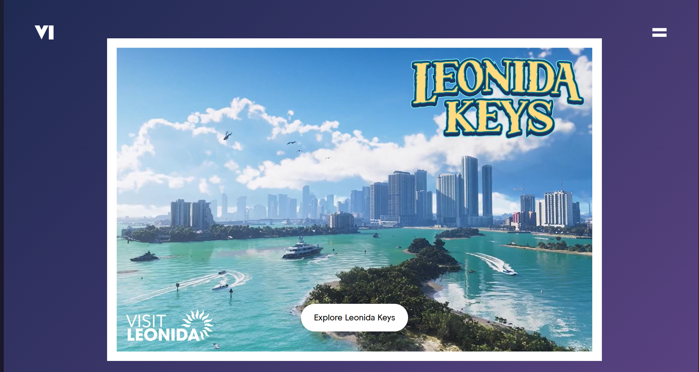

# 🚗 Grand Theft Auto VI (GTA 6) Fan Website

A visually immersive and scroll-animated GTA 6 fan website built using **React.js** and **GSAP**. This project replicates the cinematic feel of Rockstar’s media using official visuals, motion effects, and a fully responsive layout. Hosted seamlessly on **Vercel**.

## 🌐 Live Demo

🔗 [https://gta-vi-peach.vercel.app/](https://gta-vi-peach.vercel.app/)

---

## 📸 Screenshots

| Landing Page | Characters Section | Outro Section |
|--------------|--------------------|------------------|
|  |  !Lucia[](./screenshots/Lucia.png)  |  |

---

## 🚀 Tech Stack

- **React.js** – Component-based UI
- **GSAP** – Scroll-triggered animations and motion effects
- **Tailwind CSS** – Utility-first styling
- **Vercel** – Hosting and deployment

---

## 🎬 Features

- ⚡ Smooth scroll-based animations using GSAP
- 🎞️ Trailer video integration
- 🎨 Stylish UI with official GTA VI visuals
- 🌐 Responsive design for all screen sizes
- 📽️ Cinematic experience with parallax and motion effects

---

## 🖼️ Media Attribution

All images, SVGs, and video assets used in this project are sourced from **Rockstar Games**’ official media:

- 🔗 [https://www.rockstargames.com/gta-vi](https://www.rockstargames.com/gta-vi)
- 🔗 [https://www.rockstargames.com/videos](https://www.rockstargames.com/videos)

This is a **fan-made portfolio project** and is not affiliated with or endorsed by Rockstar Games. All content rights belong to their respective owners.

---

## 🛠️ Getting Started Locally

```bash
git clone https://github.com/your-username/gta6-website.git
cd GTA-VI
npm install
npm run dev
```
